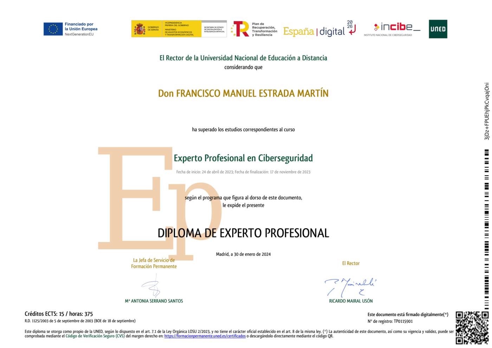
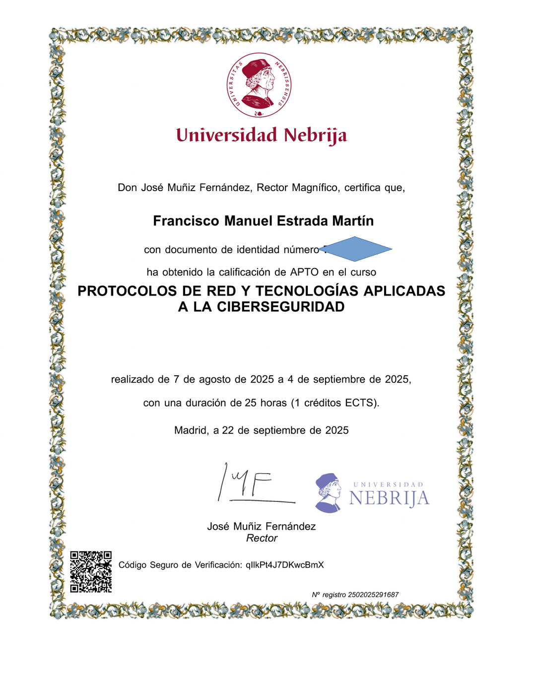
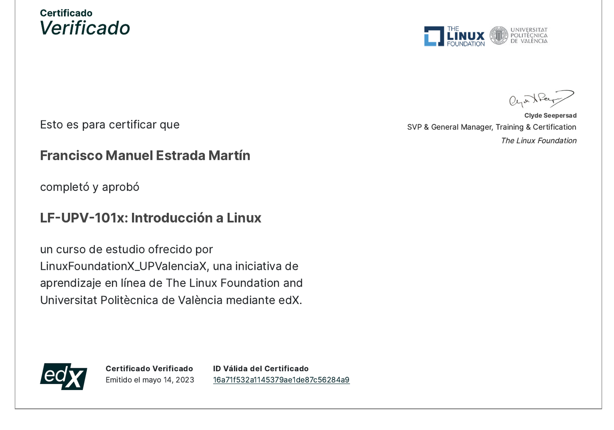
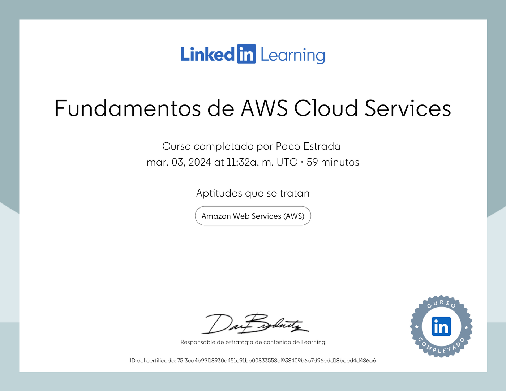
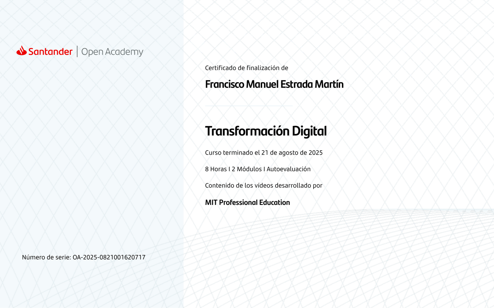
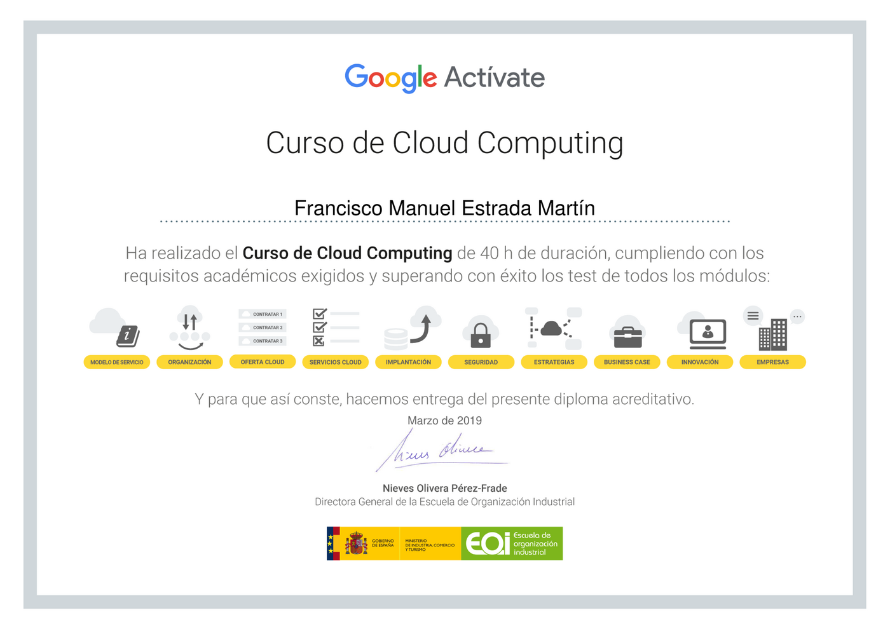
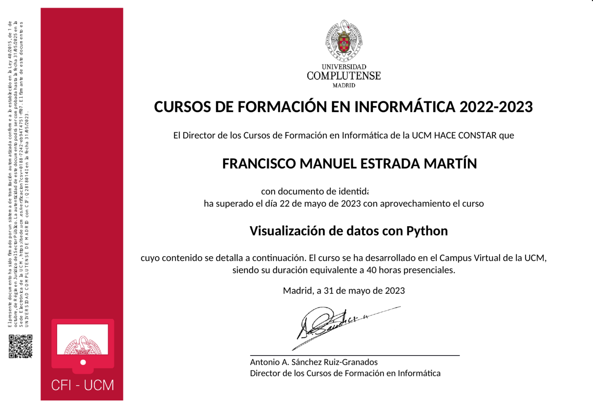

# Hola, soy Paco Estrada 👋

### Comunicación, audio, software libre y tecnología aplicada

Cuento con más de 35 años de experiencia en producción sonora y locución. Actualmente aplico esa trayectoria al lugar donde se cruzan la comunicación, la divulgación tecnológica y el software libre.

Produzco contenidos para radio y pódcast, colaboro con comunidades y eventos FLOSS y desarrollo pequeñas herramientas para resolver necesidades reales, especialmente en GNU/Linux.

## Áreas de trabajo e interés

- Producción sonora, locución, radio y pódcast.
- Comunicación y divulgación tecnológica.
- GNU/Linux, software libre y cultura abierta.
- Automatización y utilidades con Bash, Python, Git y FFmpeg.
- Organización, presentación y moderación de eventos.
- Experimentación práctica con inteligencia artificial y prompting.

## Tecnologías

## Proyectos destacados

### [Conversor de medios para DaVinci Resolve en Linux](https://github.com/pacoestrada/conversor-medios-davinci-linux)

Aplicación gráfica en Bash y FFmpeg que convierte por lotes archivos MP4 a contenedor MOV. Mantiene el vídeo original sin recodificar y transforma el audio a PCM de 24 bits para facilitar la edición en DaVinci Resolve sobre Linux.

### [OpenSouthCode 2023](https://github.com/pacoestrada/OSC2023)

Materiales para la producción de entrevistas a ponentes de OpenSouthCode 2023 en Málaga, junto con scripts en Python para analizar y representar los lenguajes y entornos de desarrollo utilizados.

### [Herramienta de Prompting](https://github.com/pacoestrada/HerramientaDePrompting)

Proyecto de experimentación práctica con la creación y organización de instrucciones para herramientas de inteligencia artificial.

## Formación tecnológica

Mi formación combina programas universitarios, cursos profesionales y credenciales especializadas en ciberseguridad, redes, GNU/Linux, computación en la nube, transformación digital, software abierto y análisis de datos con Python.

Pulsa sobre cualquier diploma para abrirlo a mayor tamaño.

### Ciberseguridad y redes

<table>
  <tr>
    <td width="50%" align="center" valign="top">
       
      <strong>Experto Profesional en Ciberseguridad</strong> 
      UNED · 15 ECTS / 375 horas · 2023
    </td>
    <td width="50%" align="center" valign="top">
       
      <strong>Protocolos de red y tecnologías aplicadas a la ciberseguridad</strong> 
      Universidad Nebrija · 25 horas / 1 ECTS · 2025
    </td>
  </tr>
</table>

### GNU/Linux y servicios en la nube

<table>
  <tr>
    <td width="50%" align="center" valign="top">
       
      <strong>LF-UPV-101x: Introducción a Linux</strong> 
      The Linux Foundation y Universitat Politècnica de València · edX · 2023
    </td>
    <td width="50%" align="center" valign="top">
       
      <strong>Fundamentos de AWS Cloud Services</strong> 
      LinkedIn Learning · 2024
    </td>
  </tr>
</table>

### Transformación digital, cloud y datos

<table>
  <tr>
    <td width="50%" align="center" valign="top">
       
      <strong>Transformación Digital</strong> 
      Santander Open Academy · Contenidos de MIT Professional Education · 2025
    </td>
    <td width="50%" align="center" valign="top">
       
      <strong>Curso de Cloud Computing</strong> 
      Google Actívate y EOI · 40 horas · 2019
    </td>
  </tr>
  <tr>
    <td colspan="2" align="center" valign="top">
       
      <strong>Visualización de datos con Python</strong> 
      Universidad Complutense de Madrid · 40 horas · 2023
    </td>
  </tr>
</table>

### Credenciales IBM

<table>
  <tr>
    <td width="50%" align="center" valign="top">
       
      <strong>Python for Data Science</strong> 
      IBM
    </td>
    <td width="50%" align="center" valign="top">
       
      <strong>Open Source Foundations</strong> 
      IBM
    </td>
  </tr>
</table>

## Comunicación y comunidad

Produzco [Compilando Podcast](https://compilando.es), un espacio dedicado a GNU/Linux, el software libre y la cultura abierta.

También he participado en iniciativas y eventos tecnológicos como OpenSouthCode y OpenExpo Europe, colaborando en tareas de organización, comunicación, presentación y moderación.

## Contacto

- [Compilando Podcast](https://compilando.es)
- [LinkedIn](https://www.linkedin.com/in/pacoestrada/)
- [MyPublicInbox](https://www.mypublicinbox.com/PacoEstrada)
